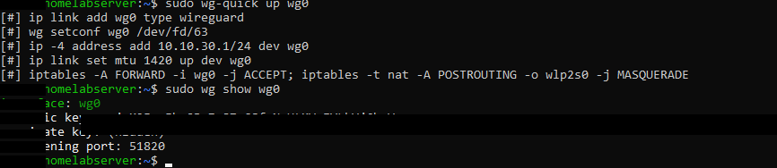
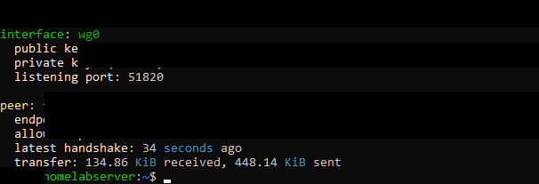

# IR-004 — WireGuard Keys Directory Permission Denied

**Date:** 2026-06-19
**Severity:** Informational
**Status:** Closed — Expected Behaviour
**System:** homelabserver — WireGuard / filesystem permissions

---

## Summary

After creating `/etc/wireguard/keys` with `sudo mkdir`, attempting to `cd` into the directory as a normal user produced "Permission denied". Investigated and confirmed this is correct security behaviour.

---

## Detection

```bash
$ sudo mkdir -p /etc/wireguard/keys
$ cd /etc/wireguard/keys
-bash: cd: /etc/wireguard/keys: Permission denied
```

---

## Root Cause

`/etc/wireguard` is created by `wireguard-tools` with permissions `0700` (root-only). Subdirectories inherit restricted access. The `umask 077` used during key generation further ensures `0600` on all created files.

```bash
$ ls -la /etc/ | grep wireguard
drwx------  3 root root   60 Jun 21 05:11 wireguard
```

**This is correct and intentional.**

Key files generated with hardened permissions:



---

## Impact

None. Keys are accessible via `sudo`:

```bash
sudo ls -l /etc/wireguard/keys
# -rw------- 1 root root 45 Jun 21 05:11 server.private
# -rw------- 1 root root 45 Jun 21 05:11 server.public
```

---

## Why This Is Correct

| Permission | Who can read | Risk if violated |
|---|---|---|
| `0600` (correct) | root only | None |
| `0644` (wrong) | any local user | Key extraction, VPN impersonation |
| `0664` (wrong) | root + group | Privilege escalation path |

Key generation pattern used:

```bash
sudo sh -c 'umask 077; wg genkey | tee /etc/wireguard/keys/server.private \
  | wg pubkey > /etc/wireguard/keys/server.public'
```

WireGuard connected with correct permissions — active peer handshake confirmed:



---

## Lessons Learned

1. `sudo mkdir` creates root-owned directories — your user still can't enter without sudo
2. Permission denied on key material is a feature, not a failure
3. Always use `umask 077` when generating any cryptographic key material on disk

---

## Security+ Mapping

- **D3.3 PKI and Cryptography** — key protection, filesystem permissions for cryptographic material
- **D3.1 Host Hardening** — principle of least privilege applied to file permissions
